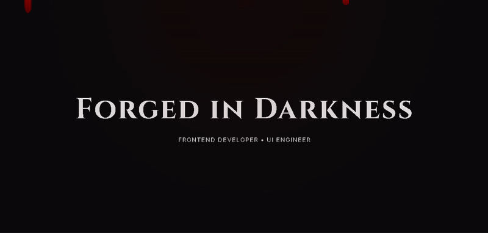

# Dark Gothic Portfolio

A dark, immersive portfolio website with Gothic aesthetics and smooth animations. Built with vanilla HTML, CSS, and JavaScript, featuring blood drip effects, elegant typography, and a mysterious atmosphere.

## ✨ Features

- **🩸 Blood Drip Animation**: Atmospheric blood drops falling from the top of the screen
- **🌙 Dark Gothic Theme**: Deep blacks with crimson red accents
- **📱 Responsive Design**: Fully responsive layout that works on all devices
- **🎭 Elegant Typography**: Beautiful Cinzel serif font for headings and Inter for body text
- **✨ Smooth Animations**: CSS animations for hero text reveal and section transitions
- **🎨 Visual Effects**: Gradient overlays and glowing hover effects
- **📖 Chronicles Section**: Project showcase with Chapter-themed naming

## 🎯 Demo



🚀 **Live Demo**: [View Portfolio](https://dzelHub.github.io/dark-gothic-portfolio)

### Screenshots

```
🏠 Hero Section: "Forged in Darkness" with blood drip effects
📝 About Section: Dark themed personal introduction
🎮 Chronicles: Project showcase with Gothic styling
```

## 🛠️ Technologies Used

- **HTML5** - Semantic markup
- **CSS3** - Advanced styling and animations
- **Google Fonts** - Cinzel & Inter typography
- **CSS Grid** - Responsive project layout
- **CSS Animations** - Blood drips and reveal effects

## 🚀 Getting Started

### Prerequisites

- A modern web browser
- Basic knowledge of HTML/CSS (for customization)

### Installation

1. **Clone the repository**

   ```bash
   git clone https://github.com/DZELHub/dark-gothic-portfolio.git
   cd dark-gothic-portfolio
   ```

2. **Open in browser**

   ```bash
   # Simply open index.html in your preferred browser
   open index.html
   # or
   double-click index.html
   ```

3. **For development**
   ```bash
   # Use a local server (recommended)
   npx live-server
   # or use VS Code Live Server extension
   ```

## 📁 Project Structure

```
dark-gothic-portfolio/
├── index.html          # Main HTML file
├── style.css           # All styles and animations
├── README.md           # Project documentation
└── LICENSE             # License file
```

## 🎨 Customization

### Color Scheme

```css
:root {
  --bg-color: #0b0b0b; /* Main background */
  --text-color: #e5e5e5; /* Text color */
  --accent-color: #8b0000; /* Red accent color */
}
```

### Typography

- **Headings**: Cinzel (Gothic serif font)
- **Body**: Inter (Modern sans-serif)

### Sections

- **Hero**: Full-screen introduction with animated text
- **About**: Personal information with reveal animation
- **Chronicles**: Project showcase grid

## 🎪 Features in Detail

### Blood Drip Effect

- 5 animated blood drops with staggered timing
- Smooth CSS keyframe animations
- Fixed positioning for persistent effect

### Responsive Grid

- Auto-fit grid layout for projects
- Minimum 260px card width
- Flexible gap spacing

### Hover Effects

- Transform animations on project cards
- Glowing red shadow effects
- Gradient overlay transitions

## 🤝 Contributing

1. Fork the project
2. Create your feature branch (`git checkout -b feature/AmazingFeature`)
3. Commit your changes (`git commit -m 'Add some AmazingFeature'`)
4. Push to the branch (`git push origin feature/AmazingFeature`)
5. Open a Pull Request

## 📝 License

This project is licensed under the MIT License - see the [LICENSE](LICENSE) file for details.

## 👤 Author

**D.Z.E.L.**

- GitHub: [@DZELHub](https://github.com/DZELHub)
- LinkedIn: [linkedin.com/in/dzelalbinay](https://www.linkedin.com/in/dzelalbinay/)

## 🙏 Acknowledgments

- Inspired by Gothic and dark fantasy aesthetics
- Google Fonts for beautiful typography
- CSS-Tricks for animation inspiration

---

⭐ Star this repo if you found it helpful!
